# 실험 결과 브리핑 — LLM은 학생의 "말투"를 따라할 수 있는가?

> **한 줄 결론:** 표면 말투(길이·1인칭·헤징 등)는 프롬프트로 **완전히** 따라하게 만들 수 있다(오히려 인간을 추월). 하지만 기능어·구두점 같은 **무의식적 stylometric 서명은 끝까지 못 따라한다** → 그게 LLM이 위조 못 하는 **인간 고유 신호**.

---

## 1. 무엇을 어떻게 했나 (3줄 요약)

- **내용은 고정, 말투만 변수.** 인간 답변별 `keywords`를 LLM(gpt-5-mini, ELICE)에 줘서 내용을 1:1로 맞추고, **말투 코칭만** R0→R1→R2로 강하게 밀었다.
  - **R0** = 키워드 + naive(코칭 0) · **R1** = +가벼운 코칭 · **R2** = +공격적 코칭(짧게·1인칭·단편)
- **두 판정자로 채점.** `STYLE7`(표면 7특징, *프롬프트가 겨냥하는* 표적) vs `STYLO`(기능어+문자3gram+구두점, *프롬프트가 안 겨냥하는* 독립 판정자). 둘은 토큰이 안 겹치게 코드로 강제(disjoint).
- **수업 2기법:** ① Classification(인간 vs LLM 판별 AUC) ② Outlier Detection(STYLO 공간 LOF). 질문별 평가(주제 교란 차단), 인간 30% 잠금 + R0 분류기 freeze.

---

## 2. 데이터 (data understanding)

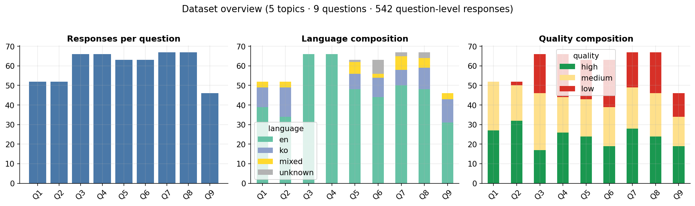

- 5 topics · 9 questions · 542 응답(분석 단위). 영어/한국어/혼합 혼재, 품질 high/medium/low 플래그(삭제 X).
- **분석 main 셋 = 영어 원문 421개** (`en_with_text`). 한국어/혼합 응답의 `english_text`는 *기계번역본*이라 **번역 혼입을 제거**하고 학생이 직접 쓴 영어만 사용(거친 ESL=인간 신호는 유지). → STYLO가 "Claude 번역 vs GPT 생성"을 인간/LLM으로 착각하는 혼동을 차단.

---

## 3. 방법론이 왜 이렇게 설계됐나 (정당화)

**(a) 질문별로 평가해야 한다 — 말투 특징이 '주제'를 담기 때문**

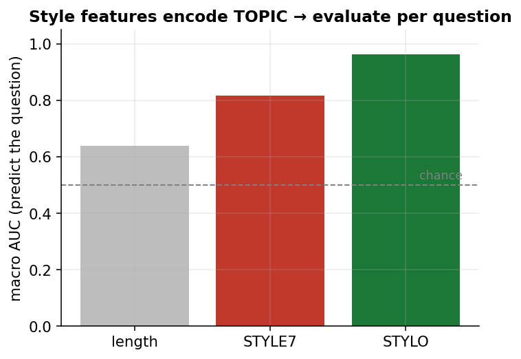

- 인간 답변만으로 "몇 번 질문인지"를 말투로 맞히면 STYLE7 **0.82**, STYLO **0.96** (랜덤 0.11). 즉 특징이 저자가 아니라 **주제**를 상당히 담음 → 질문을 섞으면 분류기가 주제로 컨닝. **그래서 질문별로만 평가.**

**(b) 우리 측정이 진짜 신호인지 — 음성통제**

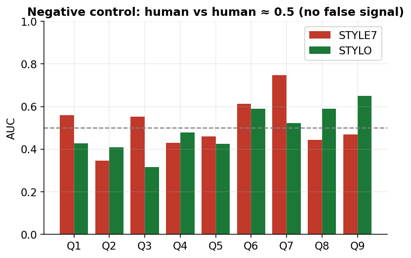

- 인간을 무작위 두 그룹으로 나눠 인간 vs 인간 판별 → **AUC≈0.5** (허위 신호 없음). 우리 분석기가 노이즈를 신호로 착각하지 않음을 보증.

---

## 4. 결과 ① — R0에서 "LLM 티"는 무엇이고, 코칭으로 어떻게 바뀌나

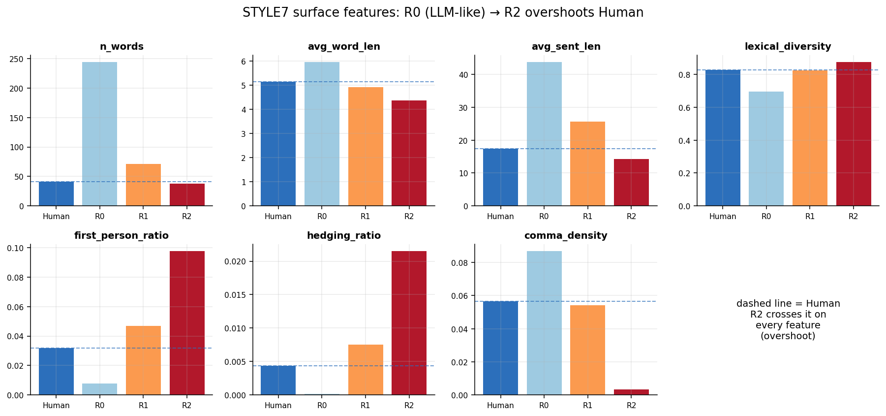

- **naive LLM(R0)의 정체 = 장황·매끈·비인격.** 인간보다 단어수 약 6배(244 vs 41), 문장 2.5배 길고, **헤징은 사실상 0**(인간 0.004 vs R0 0.000), 1인칭은 1/4.
  - ⚠️ *팀 가정 수정:* 플랜은 "LLM이 헤징 많음 → 줄이자"였지만 **실측은 정반대** — 인간이 더 머뭇거림. 그래서 R2 코칭을 "헤징 늘리기"로 바로잡음.
- **코칭하면 모든 특징이 인간을 넘어 overshoot.** R2는 인간보다 더 짧고·더 1인칭·더 헤징·쉼표 거의 0 (점선=인간 기준선을 전부 통과).
- **그래서 뭐?** 표면 말투는 프롬프트로 **완전히** 조절된다(캐리커처가 될 정도). → 표면은 "인간 흉내"의 증거가 못 됨.

---

## 5. 결과 ② — 핵심: 표면은 뚫려도 서명은 버틴다 ⭐

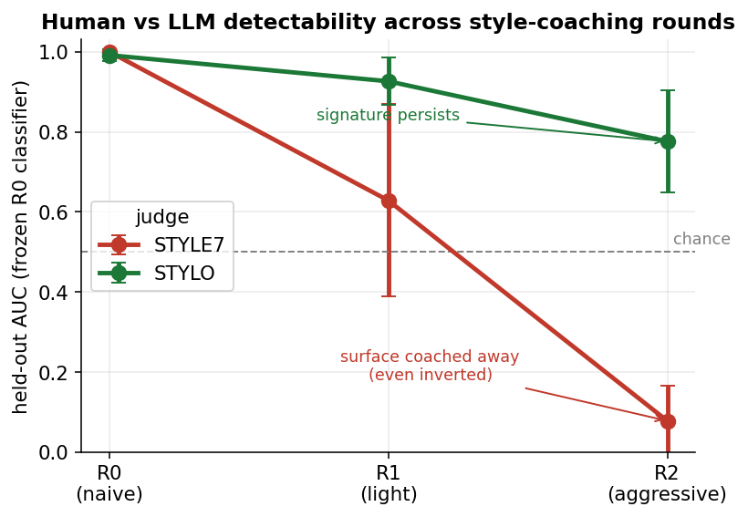

| 라운드 | STYLE7 (겨냥당함) | STYLO (독립) |
|---|---|---|
| R0 (naive) | 0.999 | 0.991 |
| R1 (가벼움) | 0.629 | 0.926 |
| R2 (공격적) | **0.079** | **0.776** |

- **STYLE7 0.079** = 단순 회피(0.5)를 넘어 **역전**. R0 분류기가 R2를 *인간보다 더 인간*이라고 오판 (overshoot의 결과). → 표면 탐지기는 완전히 무력화.
- **STYLO 0.776** = 같은 R2 답변을 **여전히 LLM으로 잡아냄.** 프롬프트가 안 건드린 기능어·구두점·문자 리듬이 끝까지 남음.
- **그래서 뭐?** 같은 답변을 두 판정자가 정반대로 판정 → **"표면 말투는 닫히지만, 무의식 서명은 안 닫힌다."**

---

## 6. 결과 ③ — 두 기법이 같은 결론 (서로 보강)

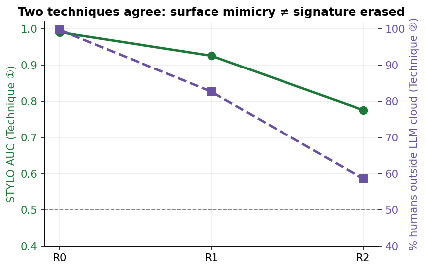 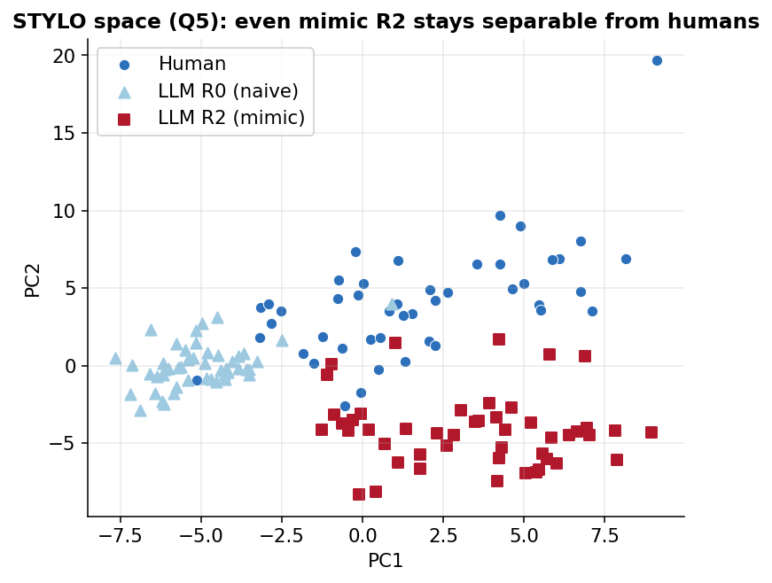

- **분류(기법①):** R2도 STYLO AUC **0.78**로 구별. **LOF(기법②):** R2 흉내에도 인간 **59%**가 LLM 구름 밖(거리 기반, 분류 재탕 아님).
- 오른쪽 PCA: 흉내낸 R2도 STYLO 공간에서 **인간과 안 섞이고 자기 군집** 유지.
- **확률 기반·거리 기반 두 각도가 독립적으로 같은 결론** → 견고함.

---

## 6-b. 결론이 데이터 선택에 흔들리지 않는다 (robustness)

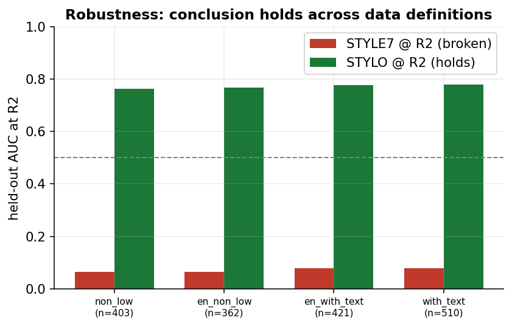

- 번역 제거(영어 원문) 여부·품질 필터를 **4가지로 바꿔도** STYLE7 R2≈0.07(붕괴) · STYLO R2≈0.77(유지)로 **동일**.
- 특히 **영어 원문만(0.78) ≈ 번역 포함(0.76)** → "STYLO=인간 서명"이 *Claude 번역기 흔적이 아님*을 입증. (교수님이 짚을 1순위 반박을 선제 방어)

---

## 6-c. Ablation — 메커니즘 분해 (세 축)

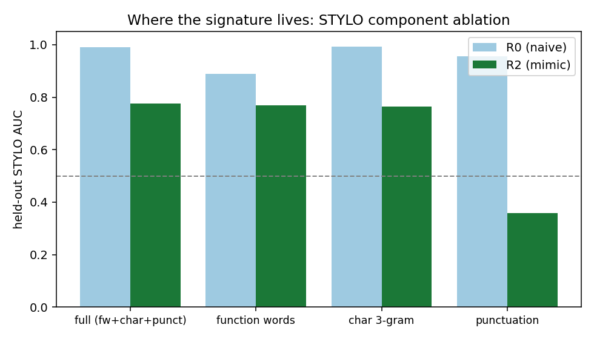
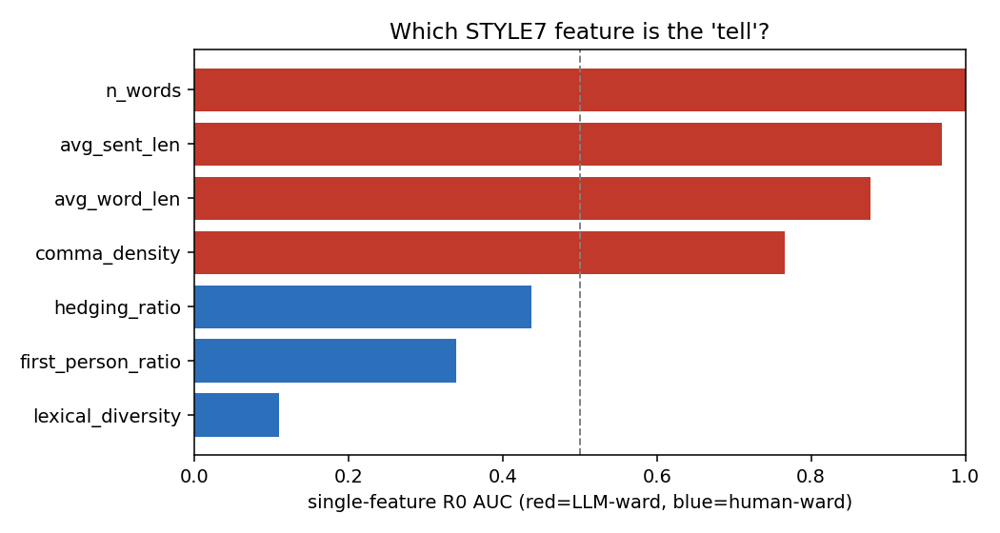
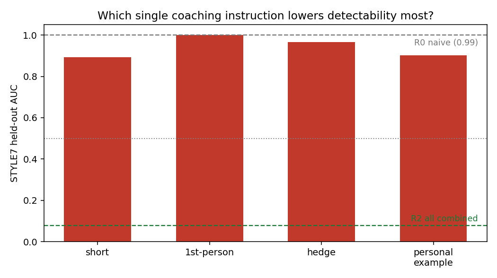

- **Ⓐ 서명의 정체:** STYLO를 쪼개면 R2 AUC를 **기능어**가 거의 다 짊어짐(0.77 ≈ 전체 0.78), **구두점은 0.36으로 붕괴**(코칭됨=표면). → 잔존 서명 = *고전 기능어 지문*. 기능어만으로 0.77 ⇒ **char-3gram 내용 누수 우려도 방어**.
- **Ⓑ 어떤 tell:** 길이(n_words) 단독 1.0이 지배하나, **길이 빼도 STYLE7=0.99** → 유일한 tell 아님. (lexical_diversity·1인칭·헤징은 인간쪽)
- **Ⓒ 어떤 코칭:** 단일 지시는 거의 무효(**1인칭만 = −0.00**, 최대 'short' −0.11), **조합(R2)만 −0.92** → 표면 회피는 **초가산적(synergy)** = 여러 tell을 *동시에* 코칭해야 뚫림. STYLO는 전 단일조건에서 ≥0.97 유지.

---

## 7. 결론

> **표면 말투(길이·1인칭·헤징·구두점밀도)는 프롬프트로 완전히 통제 가능 — 심지어 인간을 추월(overshoot).
> 그러나 기능어·문자·구두점 리듬 같은 무의식적 stylometric 서명은 공격적 코칭(R2)에도 STYLO 0.78 / LOF 59%로 버틴다.
> → 이것이 LLM이 의식적으로 못 바꾸는 "인간 고유 신호"이며, 우리 실험의 핵심 발견이다.**

---

## 8. 정직하게 짚을 한계 (Limitations)

- **STYLO도 완전 면역은 아님:** 0.99→0.78로 떨어짐(팀 예전치 0.94→0.95처럼 평평하진 않음). 단, R2에서 인간(41w)≈LLM(38w)로 **길이가 거의 같으므로 이 잔존 0.78은 길이 탓이 아님** = 진짜 서명. 일부 누수는 있으나 잔존은 견고.
- **R2는 캐리커처:** "충실한 인간 흉내"라기보다 지시 과적용(overshoot). "LLM이 인간을 *정확히* 흉내냈다"가 아니라 "표면 tell을 *무력화*했다"가 맞는 표현.
- **ESL 교란:** 인간=한국 학부 ESL, LLM=원어민 → 잔존 STYLO 서명 일부가 "비원어민 vs 원어민"일 수 있음. 본 연구 질문("LLM이 *이 학생들*을 따라하나")에선 모집단 속성이라 confound 아님 / 일반화는 안 함 → **Future Work**로 명시.

---

## 9. 재현 (코드)

```bash
pip install -r requirements.txt
# 생성(이미 완료): python src/generation/generate.py --round R0 --save   (R1/R2 동일)
python src/analysis/classify.py --round R0       # 기법① R0 AUC·계수
python src/analysis/outlier_lof.py --round R2    # 기법② LOF
python src/evaluation/round_eval.py              # 궤적 (헤드라인)
python scripts/05_figures.py                     # 모든 그림 재생성
```
- 모든 파라미터: `config/config.yaml` · 결과 수치: `results/tables/RESULTS_SUMMARY.md`
